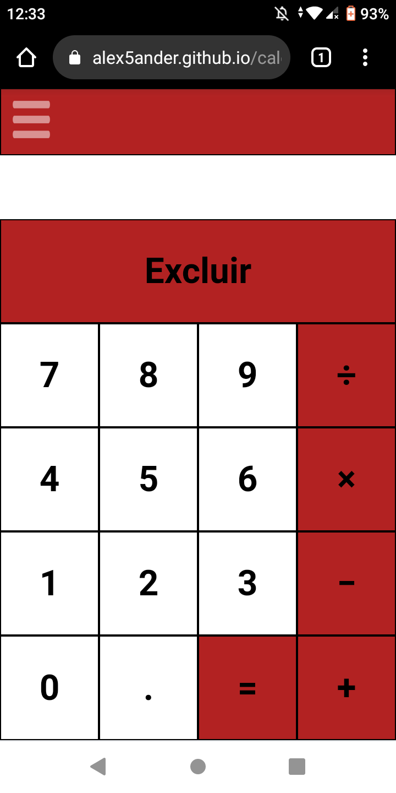
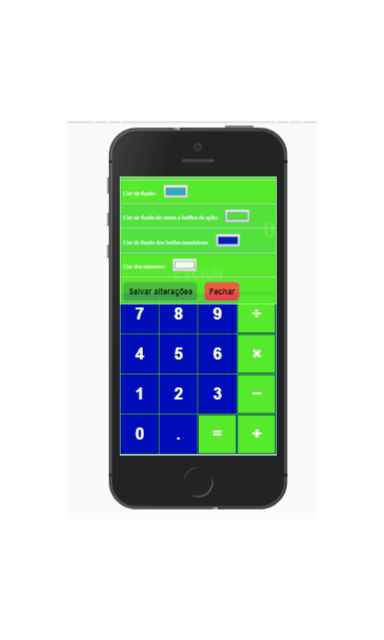

# Calculadora Clássica feita em javascript
* Possui um menu de opções que possibilita a pesonalização das cores da calculadora.
* Exemplos executado em um dispositivo android.
* PWA(Progressive Web App), ou seja o site pode ser acessado offline no dispositivo que for instalado.

[Executar a calculadora no browser](https://alex5ander.github.io/calculadoraclassica)

[Baixar a calculadora para android](https://calculadora-classica.br.aptoide.com/)
