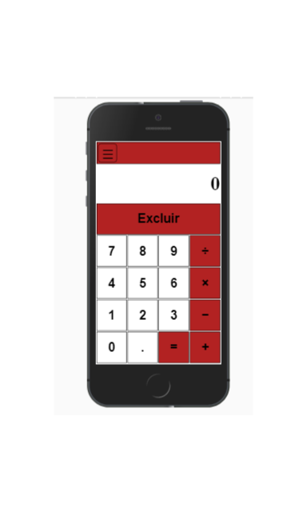

# Calculadora Clássica feita em javascript
* Exemplos executado em um dispositivo android 

[Executar a calculadora no browser](https://alex5ander.github.io/calculadoraclassica)

[Baixar a calculadora para android](https://calculadora-classica.br.aptoide.com/)
